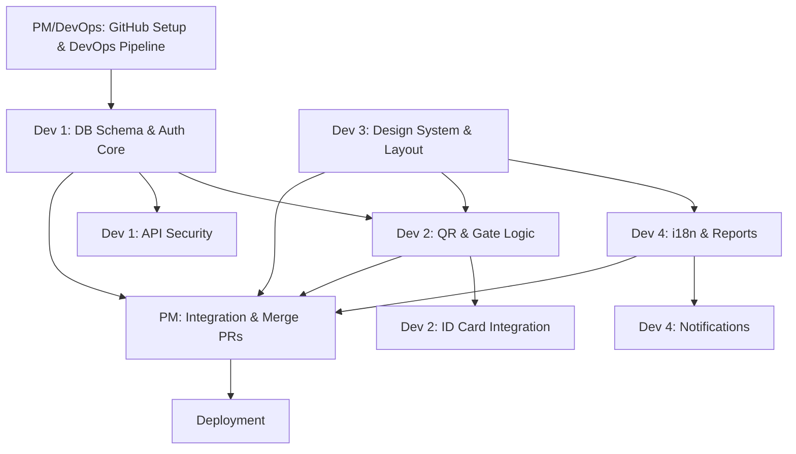

# 🏢 QR Gate Access System — Project Overview

> ระบบ QR Code เข้า–ออกประตู (Gate Access) สำหรับจัดการการเข้า-ออกอาคาร/สถานที่  
> รองรับ 3 ภาษา (ไทย / English / 中文简体) | QR หมดอายุทุกเที่ยงคืน | เชื่อมเครื่องอ่านบัตรประชาชนไทย

---

## 📋 สารบัญเอกสาร (Documentation Index)

| # | ไฟล์ | รายละเอียด | ผู้รับผิดชอบ |
| :--- | :--- | :--- | :--- |
| 00 | [project-overview.md](./00-project-overview.md) | ภาพรวมโปรเจกต์ + การแบ่งงาน | ทุกคน |
| 01 | [database-schema.md](./01-database-schema.md) | Prisma Schema, ER Diagram, Indexes | Dev 1 |
| 02 | [qr-code-management.md](./02-qr-code-management.md) | QR Lifecycle, Daily Expiration, Signing | Dev 2 |
| 03 | [gate-device-management.md](./03-gate-device-management.md) | Gate/Branch CRUD, Device Registry | Dev 2 |
| 04 | [thai-id-card-reader.md](./04-thai-id-card-reader.md) | Web USB API, APDU, Auto-register | Dev 4 |
| 05 | [auth-and-roles.md](./05-auth-and-roles.md) | Authentication, Role & Permission Matrix | Dev 1 |
| 06 | [i18n-multilanguage.md](./06-i18n-multilanguage.md) | TH/EN/ZH, next-intl, Locale Format | Dev 3 |
| 07 | [ui-design-system.md](./07-ui-design-system.md) | Color Palette, Dark/Light, Typography | Dev 3 |
| 08 | [api-reference.md](./08-api-reference.md) | All Endpoints, Zod Schemas, Error Codes | Dev 5 |
| 09 | [dashboard-reports.md](./09-dashboard-reports.md) | Dashboard, Charts, Export CSV/PDF | Dev 3 |
| 10 | [security-audit.md](./10-security-audit.md) | Security Model, PDPA, Audit Trail | Dev 5 |
| 11 | [deployment-devops.md](./11-deployment-devops.md) | Docker, CI/CD, Env Vars, Monitoring | Dev 1 |
| 12 | [notification-system.md](./12-notification-system.md) | Alerts, LINE Notify, Email | Dev 4 |

---

## 👥 การแบ่งงานสำหรับทีม (4 Devs + 1 PM/DevOps)

### 👑 Project Manager (PM) & DevOps

**ขอบเขต:** ผู้จัดการโครงการ, Integrator, และดูแลระบบหลังบ้าน

- ควบคุม Repo บน GitHub, ทำ Code Review และ Merge PR
- จัดการ CI/CD, Deployment, และความปลอดภัยของ Infrastructure

---

### Developer 1 — 🏗️ Infrastructure & Backend Core

**ขอบเขต:** รากฐานของระบบ และ API ความปลอดภัย

- ออกแบบ Prisma Schema, จัดการฐานข้อมูล (Consolidated from Dev 1 & 5)
- ระบบ Authentication (NextAuth), Authorization (RBAC)
- API Reference และระบบรักษาความปลอดภัย (Security Model)

---

### Developer 2 — 🔐 Access Control Logic & Hardware

**ขอบเขต:** ตรรกะหลักของระบบ และการเชื่อมต่ออุปกรณ์

- ระบบ QR Code Lifecycle และตรรกะหมดอายุเที่ยงคืน
- การจัดการ Gate/Branch และ Device Registry
- เชื่อมต่อเครื่องอ่านบัตรประชาชนไทย (Web USB API)

---

### Developer 3 — 🎨 UI/UX Architect

**ขอบเขต:** ส่วนหน้าบ้าน และการออกแบบดีไซน์

- Design System (Mantine v9 + Tailwind), Theme customization
- หน้า Dashboard, Real-time Gate Monitor, และ UI Components หลัก

---

### Developer 4 — 📊 Features & Integrations

**ขอบเขต:** ฟังก์ชันเสริม และการจัดการข้อมูลรายงาน

- ระบบ 3 ภาษา (i18n), ระบบรายงาน และการ Export ข้อมูล
- ระบบแจ้งเตือน (Notifications) และ Audit Trail

---

## 🔄 Dependency Flow (ลำดับการทำงาน)

---

## ⚙️ Tech Stack Summary (Updated 2026)

| Layer | Technology | Version |
| :--- | :--- | :--- |
| Framework | Next.js (App Router) | **16.x** |
| Language | TypeScript | 5.x |
| UI Components | **Mantine** | **v9** |
| Utility CSS | Tailwind CSS | 4.x |
| Database | PostgreSQL | 16 |
| ORM | Prisma | **7.x** |
| Auth | NextAuth (Auth.js) | v5 (Beta) |
| Validation | Zod | 3.x |
| i18n | next-intl | latest |
| ID Card Reader | Web USB API | Chrome 61+ |
| Container | Docker + Docker Compose | latest |

---

## 🎨 Color Specification

| สี | HEX | ใช้สำหรับ |
| :--- | :--- | :--- |
| ฟ้า (Sky Blue) | `#38BDF8` | Accent, Links, Interactive |
| เขียว (Emerald) | `#10B981` | Success, Confirm, Active |
| ขาว (White) | `#FFFFFF` | Background (Light mode) |
| น้ำเงินเข้ม (Navy) | `#1E3A5F` | Primary, Headers, Dark mode BG |

### 🌓 Theme Modes

Light Theme + Dark Theme (รายละเอียดใน `07-ui-design-system.md`)

---

## 🌏 Supported Languages

| Code | ภาษา | Font |
| :--- | :--- | :--- |
| `th` | ไทย (Default) | Noto Sans Thai |
| `en` | English | Inter |
| `zh` | 中文简体 (Simplified Chinese) | Noto Sans SC |

---

## ⏰ QR Expiration Policy

- **QR Token หมดอายุทุกวัน** ณ เวลา **23:59:59** ของวันที่ออก
- ทุก QR ที่ออกในวันนั้นจะ expire พร้อมกัน ณ เที่ยงคืน
- Cron job ทำ cleanup expired tokens ทุกวัน 00:05

---

## 🪪 Thai National ID Card Reader

- ใช้ **Web USB API** (รองรับ Chrome 61+)
- เชื่อมต่อเครื่องอ่านบัตรประชาชนไทย (Smart Card Reader)
- อ่านข้อมูล: เลขบัตร 13 หลัก, ชื่อ-สกุล TH/EN, วันเกิด, ที่อยู่, รูปถ่าย
- จะพัฒนาเป็น Phase 2 หลังจากระบบ QR หลักเสร็จ
- รายละเอียดใน `04-thai-id-card-reader.md`

---

## 📌 หมายเหตุ

อัปเดตล่าสุด: 2026-04-28
