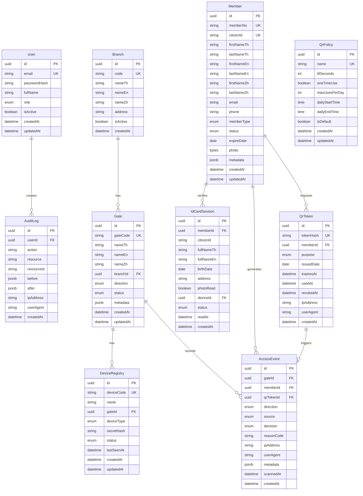

# 📊 Database Schema — QR Gate Access System

> **ผู้รับผิดชอบ:** Dev 1 — Core Infrastructure  
> **Priority:** 🔴 Critical (ต้องเสร็จก่อนเพื่อให้ Dev อื่นใช้ได้)

---

## ER Diagram



---

## Prisma Schema

```prisma
// prisma/schema.prisma

generator client {
  provider = "prisma-client-js"
}

datasource db {
  provider = "postgresql"
  url      = env("DATABASE_URL")
}

// ============================================
// ENUMS
// ============================================

enum UserRole {
  SUPER_ADMIN
  ADMIN
  GATE_OFFICER
  VIEWER
}

enum MemberType {
  STUDENT
  STAFF
  FACULTY
  EXTERNAL
  GUEST
}

enum MemberStatus {
  ACTIVE
  EXPIRED
  SUSPENDED
  REVOKED
}

enum GateDirection {
  IN
  OUT
  BIDIRECTIONAL
}

enum GateStatus {
  ACTIVE
  MAINTENANCE
  DISABLED
}

enum QrPurpose {
  ENTRY
  EXIT
}

enum AccessSource {
  QR_CODE
  ID_CARD
  MANUAL
}

enum AccessDecision {
  ALLOWED
  DENIED
}

enum DeviceType {
  QR_SCANNER
  KIOSK
  ID_CARD_READER
  MOBILE
}

enum DeviceStatus {
  ONLINE
  OFFLINE
  MAINTENANCE
  DECOMMISSIONED
}

enum IdCardReadStatus {
  SUCCESS
  PARTIAL
  FAILED
  TIMEOUT
}

// ============================================
// MODELS
// ============================================

/// ผู้ใช้ระบบ (Admin / เจ้าหน้าที่ประตู)
model User {
  id           String    @id @default(uuid()) @db.Uuid
  email        String    @unique
  passwordHash String    @map("password_hash")
  fullName     String    @map("full_name")
  role         UserRole  @default(VIEWER)
  isActive     Boolean   @default(true) @map("is_active")
  createdAt    DateTime  @default(now()) @map("created_at")
  updatedAt    DateTime  @updatedAt @map("updated_at")

  auditLogs AuditLog[]

  @@map("users")
}

/// สาขา / อาคาร
model Branch {
  id       String  @id @default(uuid()) @db.Uuid
  code     String  @unique @db.VarChar(20)
  nameTh   String  @map("name_th")
  nameEn   String  @map("name_en")
  nameZh   String  @map("name_zh")
  address  String?
  isActive Boolean @default(true) @map("is_active")
  createdAt DateTime @default(now()) @map("created_at")

  gates Gate[]

  @@map("branches")
}

/// ประตู / จุดควบคุม
model Gate {
  id        String        @id @default(uuid()) @db.Uuid
  gateCode  String        @unique @map("gate_code") @db.VarChar(20)
  nameTh    String        @map("name_th")
  nameEn    String        @map("name_en")
  nameZh    String        @map("name_zh")
  branchId  String        @map("branch_id") @db.Uuid
  direction GateDirection @default(BIDIRECTIONAL)
  status    GateStatus    @default(ACTIVE)
  metadata  Json?
  createdAt DateTime      @default(now()) @map("created_at")
  updatedAt DateTime      @updatedAt @map("updated_at")

  branch       Branch          @relation(fields: [branchId], references: [id])
  accessEvents AccessEvent[]
  devices      DeviceRegistry[]

  @@index([branchId, createdAt])
  @@map("gates")
}

/// สมาชิก / ผู้ใช้บริการ
model Member {
  id           String       @id @default(uuid()) @db.Uuid
  memberNo     String       @unique @map("member_no") @db.VarChar(30)
  citizenId    String?      @unique @map("citizen_id") @db.VarChar(13)
  firstNameTh  String       @map("first_name_th")
  lastNameTh   String       @map("last_name_th")
  firstNameEn  String?      @map("first_name_en")
  lastNameEn   String?      @map("last_name_en")
  firstNameZh  String?      @map("first_name_zh")
  lastNameZh   String?      @map("last_name_zh")
  email        String?
  phone        String?      @db.VarChar(20)
  memberType   MemberType   @default(GUEST) @map("member_type")
  status       MemberStatus @default(ACTIVE)
  expireDate   DateTime?    @map("expire_date") @db.Date
  photo        Bytes?
  metadata     Json?
  createdAt    DateTime     @default(now()) @map("created_at")
  updatedAt    DateTime     @updatedAt @map("updated_at")

  qrTokens      QrToken[]
  accessEvents  AccessEvent[]
  idCardSessions IdCardSession[]

  @@index([memberNo])
  @@index([citizenId])
  @@map("members")
}

/// QR Token — หมดอายุทุกเที่ยงคืน
model QrToken {
  id         String    @id @default(uuid()) @db.Uuid
  tokenHash  String    @unique @map("token_hash")
  memberId   String    @map("member_id") @db.Uuid
  purpose    QrPurpose @default(ENTRY)
  issuedDate DateTime  @map("issued_date") @db.Date
  expiresAt  DateTime  @map("expires_at")
  usedAt     DateTime? @map("used_at")
  revokedAt  DateTime? @map("revoked_at")
  ipAddress  String?   @map("ip_address")
  userAgent  String?   @map("user_agent")
  createdAt  DateTime  @default(now()) @map("created_at")

  member       Member        @relation(fields: [memberId], references: [id])
  accessEvent  AccessEvent?

  @@index([memberId, issuedDate])
  @@index([expiresAt])
  @@map("qr_tokens")
}

/// นโยบาย QR
model QrPolicy {
  id            String   @id @default(uuid()) @db.Uuid
  name          String   @unique @db.VarChar(50)
  ttlSeconds    Int      @default(86400) @map("ttl_seconds")
  oneTimeUse    Boolean  @default(false) @map("one_time_use")
  maxUsesPerDay Int      @default(10) @map("max_uses_per_day")
  dailyStartTime String? @map("daily_start_time") @db.VarChar(5)
  dailyEndTime   String? @map("daily_end_time") @db.VarChar(5)
  isDefault     Boolean  @default(false) @map("is_default")
  createdAt     DateTime @default(now()) @map("created_at")
  updatedAt     DateTime @updatedAt @map("updated_at")

  @@map("qr_policies")
}

/// เหตุการณ์เข้า-ออก
model AccessEvent {
  id         String         @id @default(uuid()) @db.Uuid
  gateId     String         @map("gate_id") @db.Uuid
  memberId   String         @map("member_id") @db.Uuid
  qrTokenId  String?        @unique @map("qr_token_id") @db.Uuid
  direction  GateDirection
  source     AccessSource   @default(QR_CODE)
  decision   AccessDecision
  reasonCode String?        @map("reason_code") @db.VarChar(50)
  ipAddress  String?        @map("ip_address")
  userAgent  String?        @map("user_agent")
  metadata   Json?
  scannedAt  DateTime       @map("scanned_at")
  createdAt  DateTime       @default(now()) @map("created_at")

  gate     Gate     @relation(fields: [gateId], references: [id])
  member   Member   @relation(fields: [memberId], references: [id])
  qrToken  QrToken? @relation(fields: [qrTokenId], references: [id])

  @@index([gateId, scannedAt])
  @@index([memberId, scannedAt])
  @@index([scannedAt])
  @@map("access_events")
}

/// ทะเบียนอุปกรณ์ประตู
model DeviceRegistry {
  id         String       @id @default(uuid()) @db.Uuid
  deviceCode String       @unique @map("device_code") @db.VarChar(30)
  name       String
  gateId     String       @map("gate_id") @db.Uuid
  deviceType DeviceType   @map("device_type")
  secretHash String       @map("secret_hash")
  status     DeviceStatus @default(OFFLINE)
  lastSeenAt DateTime?    @map("last_seen_at")
  createdAt  DateTime     @default(now()) @map("created_at")
  updatedAt  DateTime     @updatedAt @map("updated_at")

  gate           Gate            @relation(fields: [gateId], references: [id])
  idCardSessions IdCardSession[]

  @@index([gateId])
  @@map("device_registry")
}

/// เซสชันอ่านบัตรประชาชน
model IdCardSession {
  id         String          @id @default(uuid()) @db.Uuid
  memberId   String?         @map("member_id") @db.Uuid
  citizenId  String          @map("citizen_id") @db.VarChar(13)
  fullNameTh String          @map("full_name_th")
  fullNameEn String?         @map("full_name_en")
  birthDate  DateTime?       @map("birth_date") @db.Date
  address    String?
  photoRead  Boolean         @default(false) @map("photo_read")
  deviceId   String?         @map("device_id") @db.Uuid
  status     IdCardReadStatus
  readAt     DateTime        @map("read_at")
  createdAt  DateTime        @default(now()) @map("created_at")

  member Member?         @relation(fields: [memberId], references: [id])
  device DeviceRegistry? @relation(fields: [deviceId], references: [id])

  @@index([citizenId, readAt])
  @@map("id_card_sessions")
}

/// Audit Log
model AuditLog {
  id         String   @id @default(uuid()) @db.Uuid
  userId     String?  @map("user_id") @db.Uuid
  action     String   @db.VarChar(50)
  resource   String   @db.VarChar(50)
  resourceId String?  @map("resource_id")
  before     Json?
  after      Json?
  ipAddress  String?  @map("ip_address")
  userAgent  String?  @map("user_agent")
  createdAt  DateTime @default(now()) @map("created_at")

  user User? @relation(fields: [userId], references: [id])

  @@index([userId, createdAt])
  @@index([resource, createdAt])
  @@map("audit_logs")
}
```

---

## Summary ตาราง

| ตาราง | จำนวน Fields | FK Relations | วัตถุประสงค์ |
|-------|-------------|-------------|-------------|
| `users` | 8 | → AuditLog | บัญชีแอดมิน/เจ้าหน้าที่ |
| `branches` | 7 | → Gate | สาขา/อาคาร |
| `gates` | 10 | → Branch, AccessEvent, Device | ประตู/จุดควบคุม |
| `members` | 17 | → QrToken, AccessEvent, IdCard | สมาชิก/ผู้ใช้บริการ |
| `qr_tokens` | 11 | → Member, AccessEvent | QR Token (หมดอายุเที่ยงคืน) |
| `qr_policies` | 9 | — | นโยบายการออก QR |
| `access_events` | 13 | → Gate, Member, QrToken | เหตุการณ์เข้า-ออก |
| `device_registry` | 10 | → Gate, IdCardSession | ทะเบียนอุปกรณ์ |
| `id_card_sessions` | 12 | → Member, Device | เซสชันอ่านบัตรประชาชน |
| `audit_logs` | 10 | → User | บันทึก Audit trail |

**รวม: 10 ตาราง, 12 Enums**

---

## Index Strategy

| Index | ตาราง | เหตุผล |
|-------|-------|--------|
| `(branchId, createdAt)` | gates | ค้นหา gate ตาม branch |
| `(memberId, issuedDate)` | qr_tokens | ค้นหา QR ของสมาชิกตามวัน |
| `(expiresAt)` | qr_tokens | Cleanup job หา expired tokens |
| `(gateId, scannedAt)` | access_events | รายงานตาม gate + ช่วงเวลา |
| `(memberId, scannedAt)` | access_events | ประวัติสมาชิก |
| `(scannedAt)` | access_events | รายงานรวมทั้งหมด |
| `(citizenId, readAt)` | id_card_sessions | ค้นหาการอ่านบัตร |
| `(userId, createdAt)` | audit_logs | Audit ตาม user |
| `(resource, createdAt)` | audit_logs | Audit ตาม resource type |

---

## Seed Data ที่ควรมี

```typescript
// prisma/seed.ts — ตัวอย่างข้อมูลเริ่มต้น
const seedData = {
  branches: [
    { code: 'MAIN', nameTh: 'อาคารหลัก', nameEn: 'Main Building', nameZh: '主楼' },
    { code: 'LIB',  nameTh: 'ห้องสมุด', nameEn: 'Library', nameZh: '图书馆' },
  ],
  gates: [
    { gateCode: 'MAIN-G1', nameTh: 'ประตูหน้า', nameEn: 'Front Gate', nameZh: '前门' },
    { gateCode: 'LIB-G1',  nameTh: 'ประตูห้องสมุด', nameEn: 'Library Gate', nameZh: '图书馆门' },
  ],
  qrPolicies: [
    { name: 'default', ttlSeconds: 86400, oneTimeUse: false, maxUsesPerDay: 10, isDefault: true },
    { name: 'strict',  ttlSeconds: 86400, oneTimeUse: true,  maxUsesPerDay: 2,  isDefault: false },
  ],
  adminUser: {
    email: 'admin@gate.local',
    fullName: 'System Admin',
    role: 'SUPER_ADMIN',
  },
};
```

---

*อ้างอิง: [00-project-overview.md](./00-project-overview.md) | [08-api-reference.md](./08-api-reference.md)*
