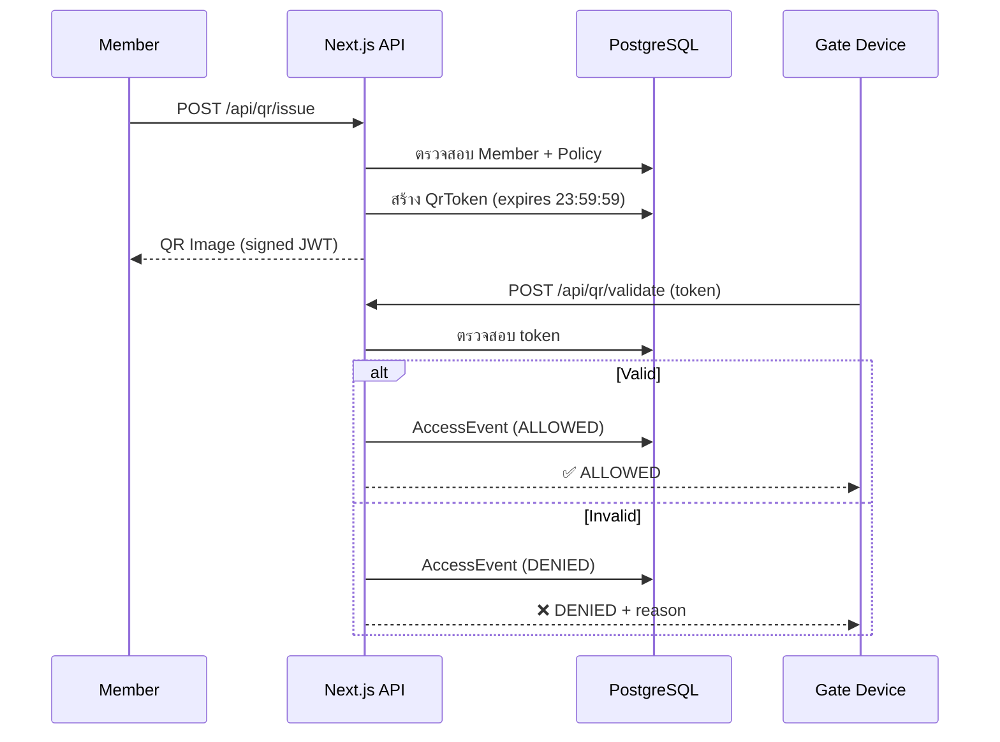

# 🔐 QR Code Management

> **ผู้รับผิดชอบ:** Dev 2 | **Priority:** 🔴 Critical  
> **Dependencies:** Database Schema (Dev 1), Auth (Dev 1)

---

## 1. QR Lifecycle



---

## 2. Daily Expiration (หมดอายุเที่ยงคืน)

| กฎ | รายละเอียด |
|----|-----------|
| เวลาหมดอายุ | **23:59:59** ของวันที่ออก QR (timezone: `Asia/Bangkok`) |
| `issuedDate` | วันที่ออก QR (DATE only) |
| `expiresAt` | `issuedDate` + `T23:59:59.999+07:00` |
| Cleanup | Cron job ทุกวัน 00:05 — revoke expired tokens |

```typescript
// lib/qr/issue-token.ts
import { endOfDay } from 'date-fns';
import { toZonedTime } from 'date-fns-tz';

const TIMEZONE = 'Asia/Bangkok';

export function calculateExpiry(): Date {
  const now = toZonedTime(new Date(), TIMEZONE);
  return endOfDay(now); // 23:59:59.999
}
```

---

## 3. Token Format (Signed JWT)

```typescript
// lib/qr/sign-token.ts
import { SignJWT, jwtVerify } from 'jose';

const QR_SECRET = new TextEncoder().encode(process.env.QR_SIGNING_SECRET);

export async function signQrToken(payload: {
  tokenId: string;
  memberId: string;
  purpose: 'ENTRY' | 'EXIT';
}) {
  return new SignJWT(payload)
    .setProtectedHeader({ alg: 'HS256' })
    .setIssuedAt()
    .setExpirationTime('24h')
    .setJti(payload.tokenId)
    .sign(QR_SECRET);
}
```

QR Payload:
```json
{
  "jti": "uuid-of-qr-token",
  "sub": "member-uuid",
  "purpose": "ENTRY",
  "iat": 1745820000,
  "exp": 1745906399
}
```

---

## 4. Validation Rules

| # | ตรวจสอบ | Reason Code | HTTP |
|---|---------|-------------|------|
| 1 | JWT signature ไม่ถูก | `INVALID_SIGNATURE` | 401 |
| 2 | Token หมดอายุ | `TOKEN_EXPIRED` | 410 |
| 3 | Token ถูกเพิกถอน | `TOKEN_REVOKED` | 410 |
| 4 | Token ถูกใช้แล้ว | `ALREADY_USED` | 409 |
| 5 | ไม่พบ Token | `TOKEN_NOT_FOUND` | 404 |
| 6 | สมาชิกไม่ active | `MEMBER_INACTIVE` | 403 |
| 7 | ประตูปิด | `GATE_DISABLED` | 403 |
| 8 | เกินจำนวนต่อวัน | `DAILY_LIMIT_EXCEEDED` | 429 |
| 9 | นอกช่วงเวลา | `OUTSIDE_HOURS` | 403 |
| 10 | ทิศทางไม่ตรง | `DIRECTION_MISMATCH` | 400 |

---

## 5. Rate Limiting

| Endpoint | Limit | Window |
|----------|-------|--------|
| `POST /api/qr/issue` | 10/สมาชิก/วัน | reset เที่ยงคืน |
| `POST /api/qr/validate` | 60/อุปกรณ์/นาที | 1 min |
| `POST /api/qr/revoke` | 5/สมาชิก/ชม. | 1h |

---

## 6. Cron Cleanup

```typescript
// app/api/cron/cleanup-tokens/route.ts
export async function POST(req: Request) {
  const result = await prisma.qrToken.updateMany({
    where: { expiresAt: { lt: new Date() }, revokedAt: null },
    data: { revokedAt: new Date() },
  });
  return NextResponse.json({ cleaned: result.count });
}
```

---

*อ้างอิง: [01-database-schema.md](./01-database-schema.md) | [08-api-reference.md](./08-api-reference.md)*
