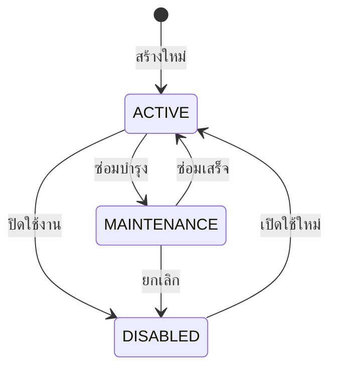
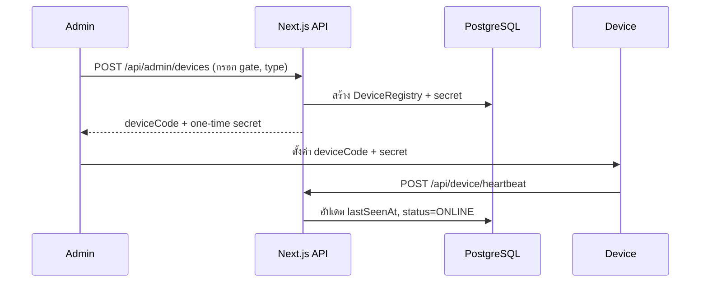

# 🚪 Gate & Device Management

> **ผู้รับผิดชอบ:** Dev 2 | **Priority:** 🔴 Critical  
> **Dependencies:** Database Schema (Dev 1)

---

## 1. Gate Management (CRUD)

### Data Model

| Field | Type | Description |
|-------|------|------------|
| `id` | UUID | Primary Key |
| `gateCode` | string | รหัสประตู เช่น `MAIN-G1` (unique) |
| `nameTh/En/Zh` | string | ชื่อ 3 ภาษา |
| `branchId` | UUID FK | สาขาที่ประตูสังกัด |
| `direction` | enum | `IN` / `OUT` / `BIDIRECTIONAL` |
| `status` | enum | `ACTIVE` / `MAINTENANCE` / `DISABLED` |
| `metadata` | JSON | ข้อมูลเพิ่มเติม (ชั้น, โซน) |

### Gate Status Flow



### Admin UI Pages

| หน้า | Path | ฟังก์ชัน |
|------|------|---------|
| รายการประตู | `/admin/gates` | ตาราง + filter ตาม branch, status |
| สร้างประตู | `/admin/gates/new` | ฟอร์มสร้าง + เลือก branch |
| แก้ไขประตู | `/admin/gates/[id]` | แก้ไขข้อมูล + เปลี่ยนสถานะ |
| รายการสาขา | `/admin/branches` | CRUD สาขา/อาคาร |

---

## 2. Branch Management

| Field | Type | Description |
|-------|------|------------|
| `id` | UUID | Primary Key |
| `code` | string | รหัสสาขา เช่น `MAIN`, `LIB` (unique) |
| `nameTh/En/Zh` | string | ชื่อ 3 ภาษา |
| `address` | string | ที่อยู่ |
| `isActive` | boolean | สถานะใช้งาน |

---

## 3. Device Registry

### Device Types

| Type | Description | การเชื่อมต่อ |
|------|------------|-------------|
| `QR_SCANNER` | เครื่องสแกน QR | Camera / USB Scanner |
| `KIOSK` | ตู้ Kiosk หน้าประตู | Touchscreen + Camera |
| `ID_CARD_READER` | เครื่องอ่านบัตรประชาชน | Web USB API |
| `MOBILE` | มือถือเจ้าหน้าที่ | Browser Camera |

### Device Registration Flow



### Device Authentication

```typescript
// middleware/device-auth.ts
import { verify } from 'argon2';

export async function authenticateDevice(
  deviceCode: string,
  secret: string
) {
  const device = await prisma.deviceRegistry.findUnique({
    where: { deviceCode },
  });
  if (!device || device.status === 'DECOMMISSIONED') return null;
  const valid = await verify(device.secretHash, secret);
  if (!valid) return null;

  await prisma.deviceRegistry.update({
    where: { id: device.id },
    data: { lastSeenAt: new Date(), status: 'ONLINE' },
  });
  return device;
}
```

---

## 4. Offline-First Mode

เมื่อเครือข่ายขัดข้อง อุปกรณ์ประตูสามารถทำงานต่อได้:

### Strategy

| กลไก | รายละเอียด |
|------|-----------|
| Local Queue | บันทึก scan events ลง IndexedDB/localStorage |
| Idempotency Key | ทุก event มี UUID — ป้องกัน duplicate เมื่อ sync |
| Sync on Reconnect | เมื่อ online ส่ง queue ทั้งหมดไป API |
| Conflict Resolution | Server timestamp เป็น source of truth |

### Offline Validation (Limited)

```typescript
// สำหรับ KIOSK ที่แคช member list
interface CachedMember {
  memberId: string;
  memberNo: string;
  status: 'ACTIVE' | 'EXPIRED';
  expireDate: string;
}

function offlineValidate(memberNo: string, cache: CachedMember[]) {
  const member = cache.find(m => m.memberNo === memberNo);
  if (!member) return { allowed: false, reason: 'NOT_IN_CACHE' };
  if (member.status !== 'ACTIVE') return { allowed: false, reason: 'INACTIVE' };
  return { allowed: true, member };
}
```

---

## 5. Gate Monitor (Real-time)

| Feature | Description |
|---------|------------|
| สถานะประตู | 🟢 Active / 🟡 Maintenance / 🔴 Disabled |
| สถานะอุปกรณ์ | Online / Offline (จาก heartbeat) |
| จำนวนคนใน/ออก | นับจาก AccessEvent วันนี้ |
| Last scan | เวลาสแกนล่าสุดของแต่ละประตู |

---

*อ้างอิง: [01-database-schema.md](./01-database-schema.md) | [02-qr-code-management.md](./02-qr-code-management.md)*
