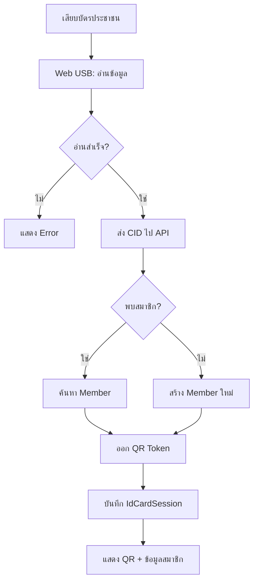

# 🪪 Thai National ID Card Reader Integration

> **ผู้รับผิดชอบ:** Dev 4 | **Priority:** 🟡 High (Phase 2)  
> **Dependencies:** Member table (Dev 1), QR Flow (Dev 2)

---

## 1. Overview

ระบบเชื่อมต่อเครื่องอ่านบัตรประชาชนไทย (Thai Smart Card) ผ่าน **Web USB API** เพื่อ:
- อ่านข้อมูลจากบัตรประชาชน → สร้าง/ค้นหา Member อัตโนมัติ
- ใช้เป็นทางเลือกเข้า-ออก นอกเหนือจาก QR Code
- บันทึก `IdCardSession` สำหรับ audit trail

### Browser Support

| Browser | Version | Support |
|---------|---------|---------|
| Chrome | 61+ | ✅ Full |
| Edge | 79+ | ✅ Full |
| Firefox | — | ❌ ไม่รองรับ Web USB |
| Safari | — | ❌ ไม่รองรับ Web USB |

---

## 2. Thai Smart Card Data Fields

| Field | APDU Command | TH | EN |
|-------|-------------|-----|-----|
| CID (เลขบัตร 13 หลัก) | `GET_CID` | เลขบัตรประชาชน | Citizen ID |
| ชื่อ-สกุล ไทย | `GET_FULLNAME_TH` | ชื่อ-สกุล | Full Name TH |
| ชื่อ-สกุล อังกฤษ | `GET_FULLNAME_EN` | ชื่อ-สกุลอังกฤษ | Full Name EN |
| วันเกิด | `GET_BIRTHDATE` | วันเกิด | Birth Date |
| ที่อยู่ | `GET_ADDRESS` | ที่อยู่ | Address |
| รูปถ่าย | `GET_PHOTO` | รูปถ่าย | Photo (JPEG) |
| วันออกบัตร | `GET_ISSUE_DATE` | วันออกบัตร | Issue Date |
| วันหมดอายุ | `GET_EXPIRE_DATE` | วันหมดอายุ | Expire Date |

---

## 3. Web USB API Integration

### APDU Commands

```typescript
// lib/idcard/apdu-commands.ts

export const THAI_ID_CARD = {
  // AID สำหรับบัตรประชาชนไทย
  SELECT: [0x00, 0xA4, 0x04, 0x00, 0x08,
           0xA0, 0x00, 0x00, 0x00, 0x54, 0x48, 0x00, 0x01],

  // คำสั่งอ่านข้อมูล
  CID:          { cmd: [0x80, 0xB0, 0x00, 0x04, 0x02, 0x00, 0x0D], len: 13 },
  FULLNAME_TH:  { cmd: [0x80, 0xB0, 0x00, 0x11, 0x02, 0x00, 0x64], len: 100 },
  FULLNAME_EN:  { cmd: [0x80, 0xB0, 0x00, 0x75, 0x02, 0x00, 0x64], len: 100 },
  BIRTHDATE:    { cmd: [0x80, 0xB0, 0x00, 0xD9, 0x02, 0x00, 0x08], len: 8 },
  ADDRESS:      { cmd: [0x80, 0xB0, 0x15, 0x79, 0x02, 0x00, 0x64], len: 100 },
  PHOTO:        { blockSize: 0xFF, blocks: 20 }, // อ่านทีละ block
};
```

### Reader Connection

```typescript
// lib/idcard/reader.ts

export class ThaiIdCardReader {
  private device: USBDevice | null = null;

  async connect(): Promise<boolean> {
    try {
      this.device = await navigator.usb.requestDevice({
        filters: [
          { vendorId: 0x04E6 },  // SCM Microsystems
          { vendorId: 0x076B },  // OmniKey
          { vendorId: 0x072F },  // ACS (Advanced Card Systems)
        ],
      });
      await this.device.open();
      await this.device.selectConfiguration(1);
      await this.device.claimInterface(0);
      return true;
    } catch (err) {
      console.error('USB connection failed:', err);
      return false;
    }
  }

  async readCitizenId(): Promise<string | null> {
    if (!this.device) return null;
    const result = await this.sendAPDU(THAI_ID_CARD.CID.cmd);
    return result ? this.decodeThaiString(result) : null;
  }

  async readAllData(): Promise<ThaiIdData | null> {
    const cid = await this.readCitizenId();
    if (!cid) return null;
    return {
      citizenId: cid,
      fullNameTh: await this.readField('FULLNAME_TH'),
      fullNameEn: await this.readField('FULLNAME_EN'),
      birthDate: await this.readField('BIRTHDATE'),
      address: await this.readField('ADDRESS'),
    };
  }

  async disconnect() {
    if (this.device) {
      await this.device.releaseInterface(0);
      await this.device.close();
      this.device = null;
    }
  }

  private async sendAPDU(cmd: number[]): Promise<Uint8Array | null> {
    // Implementation depends on reader protocol
    // ...
  }

  private decodeThaiString(data: Uint8Array): string {
    const decoder = new TextDecoder('tis-620');
    return decoder.decode(data).trim();
  }
}

export interface ThaiIdData {
  citizenId: string;
  fullNameTh: string | null;
  fullNameEn: string | null;
  birthDate: string | null;
  address: string | null;
  photo?: Blob | null;
}
```

---

## 4. Auto-Registration Flow



### API Endpoint

```typescript
// app/api/idcard/register/route.ts
export async function POST(req: Request) {
  const body = await req.json();
  const { citizenId, fullNameTh, fullNameEn, birthDate, deviceId } = body;

  // 1. ค้นหาสมาชิกจาก citizenId
  let member = await prisma.member.findUnique({
    where: { citizenId },
  });

  // 2. ถ้าไม่พบ → สร้างใหม่
  if (!member) {
    const [firstName, lastName] = parseThaiName(fullNameTh);
    member = await prisma.member.create({
      data: {
        memberNo: generateMemberNo(),
        citizenId,
        firstNameTh: firstName,
        lastNameTh: lastName,
        firstNameEn: fullNameEn?.split(' ')[0] ?? '',
        lastNameEn: fullNameEn?.split(' ').slice(1).join(' ') ?? '',
        memberType: 'EXTERNAL',
        status: 'ACTIVE',
      },
    });
  }

  // 3. บันทึก IdCardSession
  await prisma.idCardSession.create({
    data: {
      memberId: member.id,
      citizenId,
      fullNameTh,
      fullNameEn,
      birthDate: birthDate ? new Date(birthDate) : null,
      deviceId,
      status: 'SUCCESS',
      readAt: new Date(),
    },
  });

  // 4. ออก QR Token
  const token = await issueQrToken(member.id, 'ENTRY');

  return NextResponse.json({ member, token });
}
```

---

## 5. Privacy & Data Handling (PDPA)

| ข้อมูล | การจัดเก็บ | ระยะเวลา |
|--------|-----------|----------|
| CID (เลข 13 หลัก) | เก็บแบบ encrypted | ตลอดอายุสมาชิก |
| ชื่อ-สกุล | เก็บปกติ | ตลอดอายุสมาชิก |
| ที่อยู่ | **ไม่เก็บ** ในฐานข้อมูล (อ่านเพื่อแสดงเท่านั้น) | ไม่เก็บ |
| รูปถ่าย | Optional, encrypted | ลบเมื่อหมดสมาชิก |
| IdCardSession | เก็บ log | 1 ปี แล้ว archive |

> ⚠️ ต้องแสดง **Privacy Notice** ก่อนอ่านบัตร และขอ **consent** จากผู้ใช้

---

## 6. Supported Card Readers

| ยี่ห้อ | รุ่น | Vendor ID | สถานะ |
|-------|------|-----------|--------|
| ACS | ACR39U | `0x072F` | ✅ ทดสอบแล้ว |
| SCM | SCR3310 | `0x04E6` | ✅ ทดสอบแล้ว |
| HID | OmniKey 3121 | `0x076B` | 🟡 รอทดสอบ |

---

*อ้างอิง: [01-database-schema.md](./01-database-schema.md) | [10-security-audit.md](./10-security-audit.md)*
