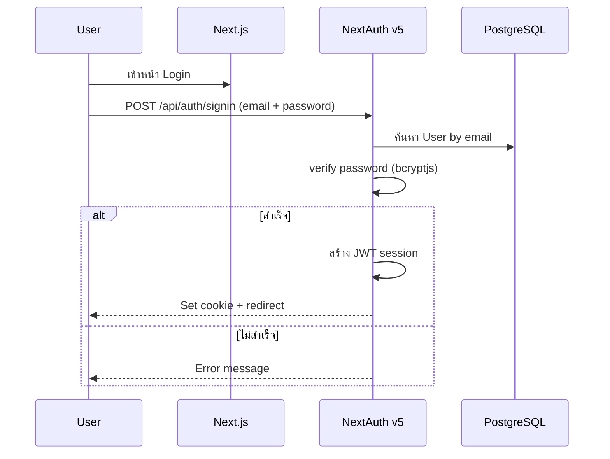

# 🔑 Authentication & Roles

> **ผู้รับผิดชอบ:** Dev 1 | **Priority:** 🔴 Critical  
> **Tech:** NextAuth v5 (Auth.js)

---

## 1. Role Definitions

| Role | รหัส | คำอธิบาย |
|------|------|---------|
| Super Admin | `SUPER_ADMIN` | จัดการทุกอย่าง + จัดการ User |
| Admin | `ADMIN` | จัดการ Gate, Member, Policy, ดูรายงาน |
| Gate Officer | `GATE_OFFICER` | สแกน QR, ดู Access log ของประตูที่รับผิดชอบ |
| Viewer | `VIEWER` | ดูรายงานอย่างเดียว |

---

## 2. Permission Matrix

| Resource | Action | Super Admin | Admin | Gate Officer | Viewer |
|----------|--------|:-----------:|:-----:|:------------:|:------:|
| **User** | Create/Edit/Delete | ✅ | ❌ | ❌ | ❌ |
| **User** | View | ✅ | ✅ | ❌ | ❌ |
| **Gate** | Create/Edit/Delete | ✅ | ✅ | ❌ | ❌ |
| **Gate** | View | ✅ | ✅ | ✅ (own) | ✅ |
| **Branch** | CRUD | ✅ | ✅ | ❌ | ❌ |
| **Member** | Create/Edit | ✅ | ✅ | ❌ | ❌ |
| **Member** | View | ✅ | ✅ | ✅ | ✅ |
| **Member** | Delete/Suspend | ✅ | ✅ | ❌ | ❌ |
| **QR Policy** | CRUD | ✅ | ✅ | ❌ | ❌ |
| **QR Token** | Issue (for member) | ✅ | ✅ | ✅ | ❌ |
| **QR Token** | Revoke | ✅ | ✅ | ❌ | ❌ |
| **Access Event** | View all | ✅ | ✅ | ❌ | ✅ |
| **Access Event** | View own gate | ✅ | ✅ | ✅ | ✅ |
| **Audit Log** | View | ✅ | ❌ | ❌ | ❌ |
| **Device** | CRUD | ✅ | ✅ | ❌ | ❌ |
| **Dashboard** | View | ✅ | ✅ | ✅ (limited) | ✅ |
| **Export** | CSV/PDF | ✅ | ✅ | ❌ | ✅ |
| **Settings** | System config | ✅ | ❌ | ❌ | ❌ |

---

## 3. Auth Flow



### NextAuth Config

```typescript
// auth.ts
import NextAuth from 'next-auth';
import Credentials from 'next-auth/providers/credentials';
import { compare } from 'bcryptjs';
import { prisma } from '@/lib/prisma';

export const { handlers, auth, signIn, signOut } = NextAuth({
  providers: [
    Credentials({
      credentials: {
        email: { label: 'Email', type: 'email' },
        password: { label: 'Password', type: 'password' },
      },
      async authorize(credentials) {
        const user = await prisma.user.findUnique({
          where: { email: credentials.email as string },
        });
        if (!user || !user.isActive) return null;
        const valid = await compare(
          credentials.password as string,
          user.passwordHash
        );
        if (!valid) return null;
        return {
          id: user.id,
          email: user.email,
          name: user.fullName,
          role: user.role,
        };
      },
    }),
  ],
  callbacks: {
    jwt({ token, user }) {
      if (user) {
        token.role = user.role;
        token.userId = user.id;
      }
      return token;
    },
    session({ session, token }) {
      session.user.role = token.role;
      session.user.id = token.userId;
      return session;
    },
  },
  pages: {
    signIn: '/login',
    error: '/login',
  },
});
```

---

## 4. Middleware Protection

```typescript
// middleware.ts
import { auth } from '@/auth';
import { NextResponse } from 'next/server';

const ROLE_ROUTES = {
  '/admin': ['SUPER_ADMIN', 'ADMIN'],
  '/admin/users': ['SUPER_ADMIN'],
  '/admin/audit': ['SUPER_ADMIN'],
  '/gate': ['SUPER_ADMIN', 'ADMIN', 'GATE_OFFICER'],
  '/reports': ['SUPER_ADMIN', 'ADMIN', 'VIEWER'],
};

export default auth((req) => {
  const { pathname } = req.nextUrl;

  // Public routes
  if (pathname.startsWith('/login') || pathname.startsWith('/api/auth')) {
    return NextResponse.next();
  }

  // Must be authenticated
  if (!req.auth) {
    return NextResponse.redirect(new URL('/login', req.url));
  }

  // Check role-based access
  const userRole = req.auth.user.role;
  for (const [route, roles] of Object.entries(ROLE_ROUTES)) {
    if (pathname.startsWith(route) && !roles.includes(userRole)) {
      return NextResponse.redirect(new URL('/unauthorized', req.url));
    }
  }

  return NextResponse.next();
});

export const config = {
  matcher: ['/((?!_next/static|_next/image|favicon.ico).*)'],
};
```

---

## 5. Session Security

| Setting | Value | เหตุผล |
|---------|-------|--------|
| Session strategy | JWT | ไม่ต้องเก็บ session ใน DB |
| Token lifetime | 8 ชั่วโมง | ตาม shift การทำงาน |
| Refresh | Sliding window | ต่ออายุเมื่อ active |
| Cookie | `httpOnly`, `secure`, `sameSite=lax` | ป้องกัน XSS/CSRF |
| Password hash | bcryptjs | เข้ากันได้กับ Turbopack/Next.js ดีกว่า |

---

*อ้างอิง: [01-database-schema.md](./01-database-schema.md) | [10-security-audit.md](./10-security-audit.md)*
