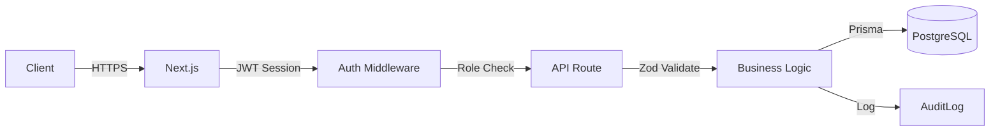

# 🛡️ Security & Audit

> **ผู้รับผิดชอบ:** Dev 5 | **Priority:** 🟡 High  
> **Dependencies:** Auth (Dev 1), API (Dev 5)

---

## 1. Security Model Overview



---

## 2. QR Token Security

| มาตรการ | รายละเอียด |
|---------|-----------|
| Signing | HS256 JWT ด้วย `QR_SIGNING_SECRET` (แยกจาก session secret) |
| Payload | ไม่เก็บข้อมูลส่วนบุคคล — เก็บเฉพาะ `tokenId`, `memberId`, `purpose` |
| Token Hash | เก็บ hash ใน DB (ไม่เก็บ raw token) |
| One-time use | Optional per policy — mark `usedAt` เมื่อใช้ |
| Expiry | หมดเที่ยงคืนทุกวัน (Asia/Bangkok timezone) |
| Revocation | Admin สามารถ revoke ได้ทันที |

---

## 3. Rate Limiting

| Endpoint | Limit | Strategy |
|----------|-------|----------|
| `/api/qr/issue` | 10/member/day | DB counter (reset midnight) |
| `/api/qr/validate` | 60/device/min | In-memory / Redis |
| `/api/auth/signin` | 5/IP/15min | IP-based |
| `/api/idcard/register` | 10/device/hour | Device-based |
| All admin APIs | 100/user/min | Token-based |

### Implementation

```typescript
// lib/rate-limit.ts
import { headers } from 'next/headers';

const rateLimitMap = new Map<string, { count: number; resetAt: number }>();

export function rateLimit(key: string, limit: number, windowMs: number) {
  const now = Date.now();
  const entry = rateLimitMap.get(key);

  if (!entry || now > entry.resetAt) {
    rateLimitMap.set(key, { count: 1, resetAt: now + windowMs });
    return { allowed: true, remaining: limit - 1 };
  }

  if (entry.count >= limit) {
    return { allowed: false, remaining: 0, retryAfter: entry.resetAt - now };
  }

  entry.count++;
  return { allowed: true, remaining: limit - entry.count };
}
```

---

## 4. PDPA Compliance (พ.ร.บ.คุ้มครองข้อมูลส่วนบุคคล)

| ข้อกำหนด | การดำเนินการ |
|----------|-------------|
| **Consent** | แสดง Privacy Notice + ขอ consent ก่อนอ่านบัตร/ลงทะเบียน |
| **Purpose Limitation** | เก็บข้อมูลเฉพาะที่จำเป็น (ไม่เก็บที่อยู่จากบัตร) |
| **Data Minimization** | citizen_id เก็บแบบ encrypted |
| **Storage Limitation** | กำหนดระยะเวลาเก็บข้อมูล (access_events: 2 ปี) |
| **Right to Access** | สมาชิกดูข้อมูลตัวเองได้ |
| **Right to Delete** | ลบข้อมูลเมื่อร้องขอ (anonymize AccessEvent) |
| **Data Breach** | แจ้งเตือนภายใน 72 ชม. |

### Data Retention

| ข้อมูล | ระยะเวลาเก็บ | หลัง Expire |
|--------|-------------|------------|
| AccessEvent | 2 ปี | Archive → Delete |
| QrToken | 90 วัน | Delete |
| IdCardSession | 1 ปี | Archive → Delete |
| AuditLog | 3 ปี | Archive |
| Member (inactive) | 1 ปีหลัง expire | Anonymize |

---

## 5. Audit Trail

### บันทึกทุกเหตุการณ์สำคัญ

| Action | Resource | Trigger |
|--------|----------|---------|
| `CREATE` | Gate, Member, User, Device, Policy | Admin สร้างใหม่ |
| `UPDATE` | Gate, Member, User, Device, Policy | Admin แก้ไข |
| `DELETE` | Gate, Member, User, Device | Admin ลบ |
| `LOGIN` | User | เข้าสู่ระบบ |
| `LOGIN_FAILED` | User | เข้าสู่ระบบไม่สำเร็จ |
| `QR_ISSUED` | QrToken | ออก QR |
| `QR_VALIDATED` | QrToken | Validate QR |
| `QR_REVOKED` | QrToken | เพิกถอน QR |
| `ID_CARD_READ` | IdCardSession | อ่านบัตรประชาชน |
| `EXPORT` | Report | Export CSV/PDF |
| `SETTINGS_CHANGED` | System | เปลี่ยนค่าระบบ |

### Audit Log Format

```json
{
  "id": "uuid",
  "userId": "uuid",
  "action": "UPDATE",
  "resource": "Gate",
  "resourceId": "gate-uuid",
  "before": { "status": "ACTIVE" },
  "after": { "status": "MAINTENANCE" },
  "ipAddress": "192.168.1.100",
  "userAgent": "Mozilla/5.0...",
  "createdAt": "2026-04-28T10:30:00+07:00"
}
```

---

## 6. Encryption

| ข้อมูล | วิธี | Key |
|--------|------|-----|
| Password (User) | Argon2id hash | N/A (one-way) |
| Device Secret | Argon2id hash | N/A (one-way) |
| Citizen ID | AES-256-GCM | `ENCRYPTION_KEY` env |
| QR Token | HS256 JWT sign | `QR_SIGNING_SECRET` env |
| Session | JWT | `NEXTAUTH_SECRET` env |

---

## 7. Environment Secrets

| Variable | Purpose | Rotation |
|----------|---------|----------|
| `DATABASE_URL` | PostgreSQL connection | On breach |
| `NEXTAUTH_SECRET` | Session signing | 90 วัน |
| `QR_SIGNING_SECRET` | QR JWT signing | 90 วัน |
| `ENCRYPTION_KEY` | Data encryption | 180 วัน |
| `CRON_SECRET` | Cron job auth | 90 วัน |

---

## 8. Security Checklist

- [ ] HTTPS only (redirect HTTP → HTTPS)
- [ ] CORS configured (allow only known origins)
- [ ] CSP headers set
- [ ] SQL injection prevention (Prisma parameterized queries)
- [ ] XSS prevention (React auto-escaping + CSP)
- [ ] CSRF protection (SameSite cookies)
- [ ] Rate limiting on all public endpoints
- [ ] Input validation (Zod) on all endpoints
- [ ] Secrets not in code (use env vars)
- [ ] Audit logging enabled
- [ ] Data encryption for sensitive fields
- [ ] Regular secret rotation
- [ ] Penetration testing (quarterly)

---

*อ้างอิง: [05-auth-and-roles.md](./05-auth-and-roles.md) | [08-api-reference.md](./08-api-reference.md)*
