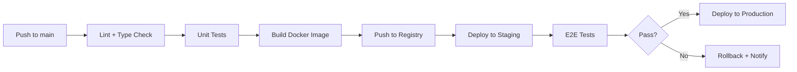

# 🚀 Deployment & DevOps

> **ผู้รับผิดชอบ:** Dev 1 | **Priority:** 🟡 High

---

## 1. Docker Compose

```yaml
# docker-compose.yml
version: '3.8'

services:
  app:
    build:
      context: .
      dockerfile: Dockerfile
      target: runner
    ports:
      - '3000:3000'
    environment:
      - DATABASE_URL=postgresql://gate_user:${DB_PASSWORD}@db:5432/gate_qr
      - NEXTAUTH_SECRET=${NEXTAUTH_SECRET}
      - NEXTAUTH_URL=${NEXTAUTH_URL}
      - QR_SIGNING_SECRET=${QR_SIGNING_SECRET}
      - ENCRYPTION_KEY=${ENCRYPTION_KEY}
      - CRON_SECRET=${CRON_SECRET}
    depends_on:
      db:
        condition: service_healthy
    restart: unless-stopped

  db:
    image: postgres:16-alpine
    environment:
      - POSTGRES_DB=gate_qr
      - POSTGRES_USER=gate_user
      - POSTGRES_PASSWORD=${DB_PASSWORD}
    volumes:
      - pg_data:/var/lib/postgresql/data
    ports:
      - '5432:5432'
    healthcheck:
      test: ['CMD-SHELL', 'pg_isready -U gate_user -d gate_qr']
      interval: 5s
      timeout: 5s
      retries: 5
    restart: unless-stopped

volumes:
  pg_data:
```

---

## 2. Dockerfile (Multi-stage)

```dockerfile
# Dockerfile
FROM node:20-alpine AS base
RUN apk add --no-cache libc6-compat
WORKDIR /app

FROM base AS deps
COPY package.json package-lock.json ./
RUN npm ci

FROM base AS builder
COPY --from=deps /app/node_modules ./node_modules
COPY . .
RUN npx prisma generate
RUN npm run build

FROM base AS runner
ENV NODE_ENV=production
RUN addgroup --system --gid 1001 nodejs
RUN adduser --system --uid 1001 nextjs
COPY --from=builder /app/public ./public
COPY --from=builder /app/.next/standalone ./
COPY --from=builder /app/.next/static ./.next/static
COPY --from=builder /app/prisma ./prisma
USER nextjs
EXPOSE 3000
ENV PORT=3000
CMD ["node", "server.js"]
```

---

## 3. Environment Variables

| Variable | Required | Default | Description |
|----------|----------|---------|------------|
| `DATABASE_URL` | ✅ | — | PostgreSQL connection string |
| `NEXTAUTH_SECRET` | ✅ | — | Session JWT secret (min 32 chars) |
| `NEXTAUTH_URL` | ✅ | — | App URL (e.g. https://gate.example.com) |
| `QR_SIGNING_SECRET` | ✅ | — | QR JWT signing secret (min 32 chars) |
| `ENCRYPTION_KEY` | ✅ | — | AES-256 key for citizen ID |
| `CRON_SECRET` | ✅ | — | Auth token for cron endpoints |
| `DB_PASSWORD` | ✅ | — | PostgreSQL password |
| `NODE_ENV` | — | `development` | `development` / `production` |
| `TZ` | — | `Asia/Bangkok` | Server timezone |

```bash
# .env.example
DATABASE_URL=postgresql://gate_user:changeme@db:5432/gate_qr
NEXTAUTH_SECRET=your-nextauth-secret-min-32-chars
NEXTAUTH_URL=http://localhost:3000
QR_SIGNING_SECRET=your-qr-signing-secret-min-32-chars
ENCRYPTION_KEY=your-aes-256-encryption-key
CRON_SECRET=your-cron-secret
DB_PASSWORD=changeme
```

---

## 4. Development Workflow

```bash
# 1. Start database
docker compose up db -d

# 2. Install dependencies
npm install

# 3. Generate Prisma client
npx prisma generate

# 4. Run migrations
npx prisma migrate dev

# 5. Seed data
npx prisma db seed

# 6. Start dev server
npm run dev
```

---

## 5. CI/CD Pipeline



### GitHub Actions (Summary)

```yaml
# .github/workflows/deploy.yml
name: Deploy
on:
  push:
    branches: [main]

jobs:
  build:
    runs-on: ubuntu-latest
    steps:
      - uses: actions/checkout@v4
      - uses: actions/setup-node@v4
        with: { node-version: 20 }
      - run: npm ci
      - run: npm run lint
      - run: npm run type-check
      - run: npm test
      - run: docker build -t gate-qr .
      - run: docker push ${{ secrets.REGISTRY }}/gate-qr
```

---

## 6. Database Backup

| Task | Schedule | Retention |
|------|----------|-----------|
| Full backup | ทุกวัน 02:00 | 30 วัน |
| WAL archiving | Continuous | 7 วัน |
| Monthly snapshot | วันที่ 1 ของเดือน | 12 เดือน |

```bash
# backup script
pg_dump -h db -U gate_user -d gate_qr -F c -f /backups/gate_qr_$(date +%Y%m%d).dump
```

---

## 7. Monitoring

| Tool | Purpose |
|------|---------|
| Docker healthcheck | Container liveness |
| `/api/health` | Application health endpoint |
| Pino logs | Structured JSON logging |
| PostgreSQL `pg_stat` | DB performance |

### Health Check Endpoint

```typescript
// app/api/health/route.ts
export async function GET() {
  try {
    await prisma.$queryRaw`SELECT 1`;
    return Response.json({
      status: 'healthy',
      timestamp: new Date().toISOString(),
      version: process.env.APP_VERSION || 'dev',
    });
  } catch {
    return Response.json({ status: 'unhealthy' }, { status: 503 });
  }
}
```

---

## 8. Migration from Legacy System

| Phase | Action | Timeline |
|-------|--------|----------|
| Phase 1 | ระบบ QR ยืนของเอง (Postgres) | Week 1-4 |
| Phase 2 | Sync Member จาก SQL Server → Postgres | Week 5-6 |
| Phase 3 | ส่ง AccessEvent กลับ warehouse | Week 7-8 |

> ⚠️ ห้ามเขียนกลับ SQL Server โดยไม่มีข้อตกลงกับทีม infra

---

*อ้างอิง: [01-database-schema.md](./01-database-schema.md) | [10-security-audit.md](./10-security-audit.md)*
