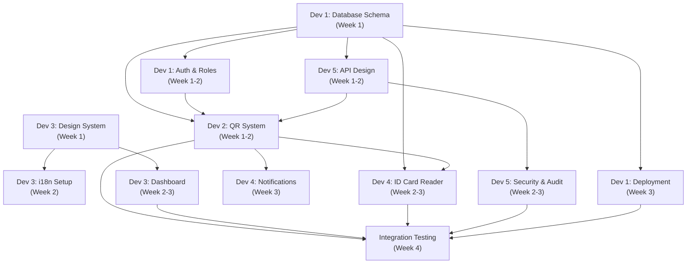

# 🏢 QR Gate Access System — Project Overview

> ระบบ QR Code เข้า–ออกประตู (Gate Access) สำหรับจัดการการเข้า-ออกอาคาร/สถานที่  
> รองรับ 3 ภาษา (ไทย / English / 中文简体) | QR หมดอายุทุกเที่ยงคืน | เชื่อมเครื่องอ่านบัตรประชาชนไทย

---

## 📋 สารบัญเอกสาร (Documentation Index)

| # | ไฟล์ | รายละเอียด | ผู้รับผิดชอบ |
|---|------|-----------|-------------|
| 00 | [project-overview.md](./00-project-overview.md) | ภาพรวมโปรเจกต์ + การแบ่งงาน | ทุกคน |
| 01 | [database-schema.md](./01-database-schema.md) | Prisma Schema, ER Diagram, Indexes | Dev 1 |
| 02 | [qr-code-management.md](./02-qr-code-management.md) | QR Lifecycle, Daily Expiration, Signing | Dev 2 |
| 03 | [gate-device-management.md](./03-gate-device-management.md) | Gate/Branch CRUD, Device Registry | Dev 2 |
| 04 | [thai-id-card-reader.md](./04-thai-id-card-reader.md) | Web USB API, APDU, Auto-register | Dev 4 |
| 05 | [auth-and-roles.md](./05-auth-and-roles.md) | Authentication, Role & Permission Matrix | Dev 1 |
| 06 | [i18n-multilanguage.md](./06-i18n-multilanguage.md) | TH/EN/ZH, next-intl, Locale Format | Dev 3 |
| 07 | [ui-design-system.md](./07-ui-design-system.md) | Color Palette, Dark/Light, Typography | Dev 3 |
| 08 | [api-reference.md](./08-api-reference.md) | All Endpoints, Zod Schemas, Error Codes | Dev 5 |
| 09 | [dashboard-reports.md](./09-dashboard-reports.md) | Dashboard, Charts, Export CSV/PDF | Dev 3 |
| 10 | [security-audit.md](./10-security-audit.md) | Security Model, PDPA, Audit Trail | Dev 5 |
| 11 | [deployment-devops.md](./11-deployment-devops.md) | Docker, CI/CD, Env Vars, Monitoring | Dev 1 |
| 12 | [notification-system.md](./12-notification-system.md) | Alerts, LINE Notify, Email | Dev 4 |

---

## 👥 การแบ่งงานสำหรับทีม 5 คน

### Developer 1 — 🏗️ Core Infrastructure & Data Layer
**ขอบเขต:** ฐานข้อมูล, Authentication, Deployment

| ไฟล์ | งาน | Priority |
|------|-----|----------|
| `01-database-schema.md` | ออกแบบ Prisma Schema ทั้งหมด, สร้าง Migration, Seed Data | 🔴 Critical |
| `05-auth-and-roles.md` | ตั้งค่า NextAuth v5, Role/Permission middleware | 🔴 Critical |
| `11-deployment-devops.md` | Docker Compose, CI/CD, Environment config | 🟡 High |

**Dependencies:** ต้องทำ Database Schema เสร็จก่อนเพื่อให้ Dev อื่นใช้ได้

---

### Developer 2 — 🔐 QR Code & Gate System
**ขอบเขต:** QR Generation/Validation, Gate Management

| ไฟล์ | งาน | Priority |
|------|-----|----------|
| `02-qr-code-management.md` | QR Issue/Validate Flow, Daily Expiration Logic, JWT Signing | 🔴 Critical |
| `03-gate-device-management.md` | Gate CRUD, Branch, Device Registry, Offline Mode | 🔴 Critical |

**Dependencies:** ต้องรอ Database Schema (Dev 1) + Auth middleware (Dev 1)

---

### Developer 3 — 🎨 Frontend & UI/UX
**ขอบเขต:** Design System, Dashboard, Multi-language UI

| ไฟล์ | งาน | Priority |
|------|-----|----------|
| `07-ui-design-system.md` | Color System, Mantine v7 Theme, Dark/Light Mode | 🔴 Critical |
| `06-i18n-multilanguage.md` | next-intl Setup, Translation Files (TH/EN/ZH) | 🟡 High |
| `09-dashboard-reports.md` | Dashboard Pages, Charts (Recharts), Export | 🟡 High |

**Dependencies:** สามารถเริ่ม Design System ได้ทันที (ไม่ต้องรอ Backend)

---

### Developer 4 — 🔌 External Integration
**ขอบเขต:** Thai ID Card Reader, Notification, Legacy System Sync

| ไฟล์ | งาน | Priority |
|------|-----|----------|
| `04-thai-id-card-reader.md` | Web USB API, APDU Commands, Auto-registration | 🟡 High |
| `12-notification-system.md` | LINE Notify, Email Alerts, In-app Notification | 🟢 Medium |

**Dependencies:** ต้องรอ Member table (Dev 1) + QR Flow (Dev 2)

---

### Developer 5 — 🛡️ API & Security
**ขอบเขต:** API Design, Security, Audit

| ไฟล์ | งาน | Priority |
|------|-----|----------|
| `08-api-reference.md` | RESTful API Design, Zod Schemas, Error Codes | 🔴 Critical |
| `10-security-audit.md` | Security Model, Rate Limiting, PDPA Compliance, Audit Log | 🟡 High |

**Dependencies:** ต้อง coordinate กับ Dev 2 (QR endpoints) + Dev 4 (ID Card endpoints)

---

## 🔄 Dependency Flow (ลำดับการทำงาน)

---

## ⚙️ Tech Stack Summary

| Layer | Technology | Version |
|-------|-----------|---------|
| Framework | Next.js (App Router) | 15.x |
| Language | TypeScript | 5.x |
| UI Components | **Mantine** | **v7** |
| Utility CSS | Tailwind CSS | 3.x |
| Database | PostgreSQL | 16 |
| ORM | Prisma | 6.x |
| Auth | NextAuth (Auth.js) | v5 |
| Validation | Zod | 3.x |
| i18n | next-intl | latest |
| ID Card Reader | Web USB API | Chrome 61+ |
| Container | Docker + Docker Compose | latest |
| Logging | Pino | latest |

---

## 🎨 Color Specification

| สี | HEX | ใช้สำหรับ |
|----|-----|----------|
| ฟ้า (Sky Blue) | `#38BDF8` | Accent, Links, Interactive |
| เขียว (Emerald) | `#10B981` | Success, Confirm, Active |
| ขาว (White) | `#FFFFFF` | Background (Light mode) |
| น้ำเงินเข้ม (Navy) | `#1E3A5F` | Primary, Headers, Dark mode BG |

**Modes:** Light Theme + Dark Theme (รายละเอียดใน `07-ui-design-system.md`)

---

## 🌏 Supported Languages

| Code | ภาษา | Font |
|------|------|------|
| `th` | ไทย (Default) | Noto Sans Thai |
| `en` | English | Inter |
| `zh` | 中文简体 (Simplified Chinese) | Noto Sans SC |

---

## ⏰ QR Expiration Policy

- **QR Token หมดอายุทุกวัน** ณ เวลา **23:59:59** ของวันที่ออก
- ทุก QR ที่ออกในวันนั้นจะ expire พร้อมกัน ณ เที่ยงคืน
- Cron job ทำ cleanup expired tokens ทุกวัน 00:05

---

## 🪪 Thai National ID Card Reader

- ใช้ **Web USB API** (รองรับ Chrome 61+)
- เชื่อมต่อเครื่องอ่านบัตรประชาชนไทย (Smart Card Reader)
- อ่านข้อมูล: เลขบัตร 13 หลัก, ชื่อ-สกุล TH/EN, วันเกิด, ที่อยู่, รูปถ่าย
- จะพัฒนาเป็น Phase 2 หลังจากระบบ QR หลักเสร็จ
- รายละเอียดใน `04-thai-id-card-reader.md`

---

*อัปเดตล่าสุด: 2026-04-28*
